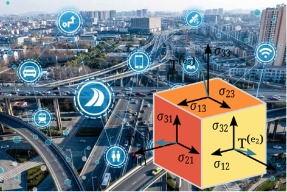
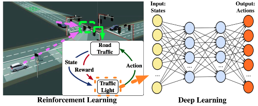

---------------
## **Details:** 

#### 0. Syllabus:  
The syllabus is available [here](https://drive.google.com/open?id=10flGnmEzIsPo6YFUhUAdim5VYlW_TyNB&authuser=bobbyli1994%40gmail.com&usp=drive_fs)

#### 1. Lecture One: High-dimensional Data (Tensor) in Smart Transportation 
  - **Time**: 3:30PM-4:45PM, 30 Jan 2023 (65-70min Lecture, 5-10min Q&A) 
  - **Location**: Zoom (https://gatech.zoom.us/j/97394420485, Meeting ID: 973 9442 0485) 
  - **Description**: In the first lecture, we will discuss how the high-dimensional data analytics, i.e., tensor methods, could well formulate the traffic data both spatially and temporally, and we will look at the most popular tasks in ITS: demand prediction, and travel pattern clustering. Specifically, we will discuss Tensor Decomposition, Tensor Completion for demand prediction, and Tensor Topic Models for travel pattern clustering.

#### 2. Lecture Two: Deep Learning in Smart Transportation  
  - **Time**: 3:30PM-4:45PM, 01 Feb 2023 (65-70min Lecture, 5-10min Q&A) 
  - **Location**: Zoom (https://gatech.zoom.us/j/97394420485, Meeting ID: 973 9442 0485) 
  - **Description**: In the second lecture, more deep learning related methods will be introduced. Specifically, we will discuss how Self-Supervised Learning can be leveraged to deal with static time-series data such as traffic flow. We will also discuss how Contrastive Learning could learn more robust representation for dynamic trajectory. Last but not the least, we will also leverage Deep Reinforcement Learning into traffic signal control and Deep Causal Inference into traffic congestion reasoning.

